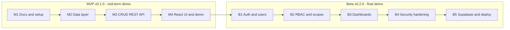

# PRD: Product Requirements Document

## PassDown

| | |
|---|---|
| **Project** | PassDown, a course-material sharing platform |
| **Course** | CSE 309 Web Applications & Internet, Independent University, Bangladesh (IUB) |
| **Author** | Tanjil Hasan Emon |
| **ID** | 2331024 |
| **Version** | 1.0 (Draft) |
| **Date** | October 2026 |
| **Related documents** | [SRS: Software Requirements Specification](./02-srs.md) · [TDD: Technical Design Document](./03-tdd.md) |

> Every goal, feature and user story in this document is tagged **MVP** or **Beta**, so it is clear what is shown at each demo.

---

## 1. Overview

PassDown is a web application that helps university students prepare for a course **before** they take it. Today the only way to preview a course during a semester gap is to find a senior and ask for their notes, which is inconsistent and does not scale.

PassDown gives every course one organised page with three sections:

- **Core Materials**: a curated, reliable set of links managed by admins.
- **Contributions**: links submitted by students and reviewed by an admin before they become public.
- **Requests**: posts where students ask for materials they cannot find.

PassDown does **not** host files. It stores and organises **links** (Google Drive, OneDrive, GitHub, etc.), so it is lightweight and runs on free-tier hosting.

## 2. Release plan

The project ships in two releases.

| Release | Demo | What is shown |
|---|---|---|
| **MVP** | Mid-term (Week 7) | Courses, core materials, contributions and requests through REST APIs (CRUD) and a React + TypeScript UI, running locally on SQLite. No login yet. |
| **Beta** | Final (Week 12) | Authentication (JWT), user roles (RBAC), security scopes, profile dashboard, admin dashboard, security hardening, and production deployment on Vercel with Supabase PostgreSQL. |

## 3. Problem statement and goals

**Problem.** Students who want to prepare for a course in advance have no central, reliable place to find its materials. They depend on personal connections with seniors, which excludes students who do not have those connections.

| ID | Release | Goal |
|---|---|---|
| G-01 | MVP | Give every course one organised page of material links. |
| G-02 | MVP | Let students request and contribute materials, with a review status for contributions. |
| G-03 | Beta | Control who can do what through authentication, role-based access control (RBAC) and security scopes. |
| G-04 | Beta | Run securely in production at zero cost (Vercel and Supabase free tiers). |
| G-05 | MVP, Beta | Demonstrate a professional workflow: issues, feature branches, pull requests and a Kanban board. |

## 4. Target users

| User | Role in the system | Release | Needs |
|---|---|---|---|
| **Prospective student** | Guest (no account) in MVP, `student` in Beta | MVP, Beta | Browse and search course materials, request missing ones. |
| **Contributor** | `student` | MVP (open), Beta (logged in) | Share links to materials they already have. |
| **Maintainer (senior)** | `admin` | MVP (open), Beta (logged in) | Curate core materials, manage courses, review contributions, oversee users. |

## 5. Scope

| Area | In scope: MVP | In scope: Beta |
|---|---|---|
| Content | Courses, core materials, contributions, requests (CRUD), contribution review status | Contribution approval restricted to admins, ownership rules |
| Access | Open API, no login | Register and login (JWT), roles `student` and `admin`, security scopes |
| Users | None | Profile dashboard, change name and password, admin user management |
| Admin | Management and moderation pages (not protected) | Admin dashboard with moderation queue and statistics |
| Data | SQLite (local) | Supabase PostgreSQL with Alembic migrations |
| Delivery | Runs locally | Deployed on Vercel (frontend and backend in one project) |

**Out of scope this semester:** file uploads or hosting, thanks and upvotes, comments, contributor leaderboard, email notifications, automatic link checking (only the URL format is validated), refresh tokens, social login, automated tests and CI/CD.

## 6. Features

MoSCoW priority: **M**ust, **S**hould, **C**ould, **W**on't (this semester).

| ID | Feature | Priority | Release |
|---|---|---|---|
| F-01 | Course catalog with search | M | MVP |
| F-02 | Core materials per course with type filter | M | MVP |
| F-03 | Course and core material management (create, edit, delete) | M | MVP |
| F-04 | Contributions: submit, list approved, edit, delete | M | MVP |
| F-05 | Contribution review (approve or reject) | M | MVP |
| F-06 | Requests: post, list, mark fulfilled, delete | M | MVP |
| F-07 | React + TypeScript user interface | M | MVP |
| F-08 | Registration and login with JWT | M | Beta |
| F-09 | RBAC and security scopes (`student`, `admin`) | M | Beta |
| F-10 | Ownership rules (edit or delete only your own items) | M | Beta |
| F-11 | User profile dashboard (own items, change name and password) | M | Beta |
| F-12 | Admin dashboard (moderation queue, statistics) | S | Beta |
| F-13 | Admin user management (deactivate and reactivate accounts) | S | Beta |
| F-14 | Login lockout and security headers | S | Beta |
| F-15 | Production deployment on Vercel with Supabase PostgreSQL | M | Beta |
| F-16 | Thanks, upvotes, comments, leaderboard | W | Future |
| F-17 | Email notifications, refresh tokens, social login | W | Future |

## 7. User stories

### MVP

| ID | Story |
|---|---|
| US-01 | As a **visitor**, I want to see a list of courses, so that I can find the one I am preparing for. |
| US-02 | As a **visitor**, I want to search courses by code or title, so that I can find a course quickly. |
| US-03 | As a **visitor**, I want to open a course and see its core materials, so that I can start preparing. |
| US-04 | As a **visitor**, I want to filter materials by type (slides, notes, past paper, book, other), so that I find what I need faster. |
| US-05 | As a **visitor**, I want to see approved student contributions for a course, so that I get more material than the core set. |
| US-06 | As a **visitor**, I want to see open requests for a course, so that I know what others are missing. |
| US-07 | As a **maintainer**, I want to create, edit and delete courses, so that the catalog stays accurate. |
| US-08 | As a **maintainer**, I want to create, edit and delete core materials, so that every course has a reliable baseline. |
| US-09 | As a **contributor**, I want to submit a link to a material for a course, so that I can help the next students. |
| US-10 | As a **contributor**, I want to edit or delete a contribution, so that I can fix mistakes. |
| US-11 | As a **maintainer**, I want to approve or reject contributions and see all pending ones, so that only good links become public. |
| US-12 | As a **student**, I want to post a request for a missing material, so that someone can provide it. |
| US-13 | As a **student**, I want to mark a request as fulfilled or delete it, so that the list stays relevant. |

### Beta

| ID | Story |
|---|---|
| US-14 | As a **visitor**, I want to register an account, so that I can contribute and request materials. |
| US-15 | As a **registered user**, I want to log in and stay signed in for a while, so that I do not repeat my credentials on every action. |
| US-16 | As the **platform owner**, I want only logged-in users to submit contributions and requests, so that spam is limited. |
| US-17 | As the **platform owner**, I want only admins to manage courses and core materials, so that the catalog stays trustworthy. |
| US-18 | As the **platform owner**, I want only admins to approve or reject contributions, so that review cannot be bypassed. |
| US-19 | As a **student**, I want only myself (and admins) to be able to change or delete my contributions and requests, so that others cannot tamper with my content. |
| US-20 | As a **student**, I want a profile dashboard showing my contributions (with their status) and my requests, so that I can track them. |
| US-21 | As a **registered user**, I want to change my display name and password, so that I control my account. |
| US-22 | As an **admin**, I want a moderation queue of pending contributions, so that I can review them in one place. |
| US-23 | As an **admin**, I want platform statistics (courses, materials, contributions by status, open requests, users), so that I can see how the platform is used. |
| US-24 | As an **admin**, I want to view users and deactivate or reactivate accounts, so that I can stop abuse. |
| US-25 | As the **platform owner**, I want the app deployed on Vercel with a production Supabase database, so that students can really use it at no cost. |

## 8. Success metrics

| Release | Metric | Target |
|---|---|---|
| MVP | MVP functional requirements implemented and shown in the demo | 100% of MVP items in [SRS §4](./02-srs.md) |
| MVP | MVP acceptance criteria (AC-01 to AC-14) passing in manual checks | 100% |
| MVP | Course list and search response time locally | Under 1 second |
| Beta | Beta acceptance criteria (AC-15 to AC-30) passing | 100% |
| Beta | Permission matrix cases verified (401 for no token, 403 for wrong role) | 100% of rows in [SRS §7](./02-srs.md) |
| Beta | Secrets committed to the repository | 0 |
| Beta | Production app reachable on Vercel with data persisted in Supabase | Yes |

## 9. Milestones

| ID | Release | Milestone | Outcome |
|---|---|---|---|
| M1 | MVP | Docs and project setup | PRD, SRS, TDD merged through a PR; Kanban board, labels and milestones ready |
| M2 | MVP | Data layer | Database models, session handling and schemas for the four content entities |
| M3 | MVP | CRUD REST API | All MVP endpoints working and documented at `/api/docs` |
| M4 | MVP | React UI and mid-term demo | UI connected to the API; release tagged `v0.1.0` |
| B1 | Beta | Authentication and users | Register, login, JWT, seeded admin account |
| B2 | Beta | RBAC and security scopes | Scope checks on every protected endpoint; ownership rules |
| B3 | Beta | Dashboards | Student profile dashboard and admin dashboard |
| B4 | Beta | Security hardening | Login lockout, security headers, validation review |
| B5 | Beta | Supabase and deployment | PostgreSQL, Alembic migrations, production deploy; release tagged `v0.2.0` |

## 10. Assumptions and risks

**Assumptions**
- Users store the actual files on their own cloud storage and share links.
- The course list is managed by admins only, so catalog data stays clean.
- Free-tier limits (cold starts, database size) are acceptable for an academic project.

**Risks**

| Risk | Mitigation |
|---|---|
| Scope creep | Features are fixed per release; extra ideas go to "Future" in section 6. |
| Dead or unsafe links | Admin review before publishing; only `http` and `https` URLs accepted; external-link notice in the UI. |
| Time pressure before demos | MVP is intentionally small; Beta items are ordered by priority (Must before Should). |

## 11. Related documents

- [SRS: Software Requirements Specification](./02-srs.md): detailed functional and non-functional requirements, permission matrix, acceptance criteria.
- [TDD: Technical Design Document](./03-tdd.md): architecture, data model, REST API design, security design, deployment.
