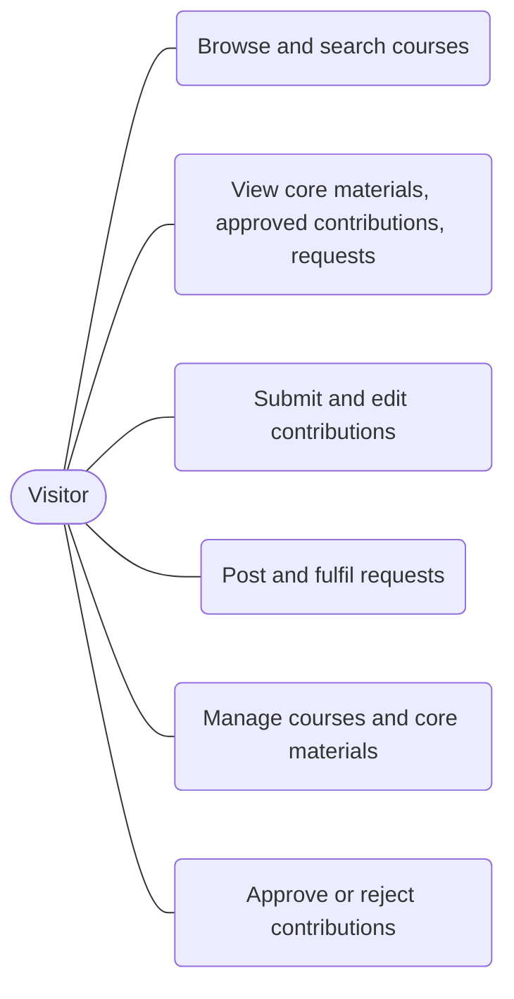
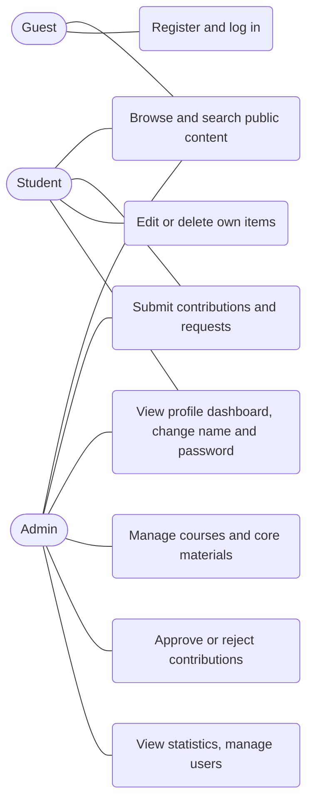
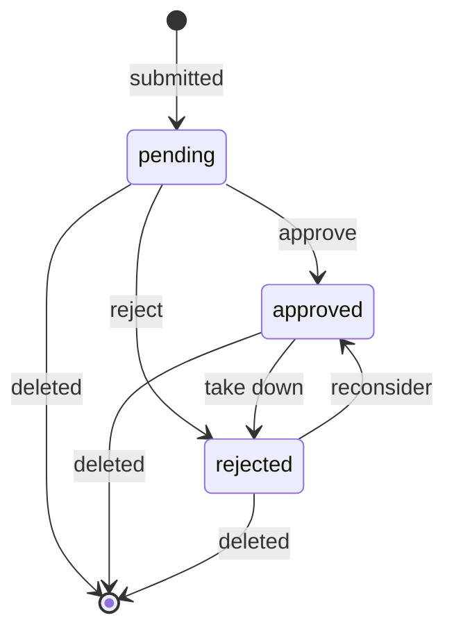
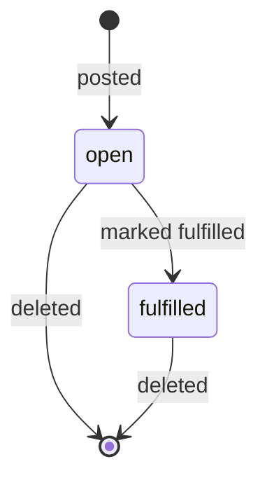

# SRS: Software Requirements Specification

## PassDown

| | |
|---|---|
| **Project** | PassDown, a course-material sharing platform |
| **Course** | CSE 309 Web Applications & Internet, Independent University, Bangladesh (IUB) |
| **Author** | Tanjil Hasan Emon |
| **ID** | 2331024 |
| **Version** | 1.0 (Draft) |
| **Date** | October 2026 |
| **Related documents** | [PRD: Product Requirements Document](./01-prd.md) · [TDD: Technical Design Document](./03-tdd.md) |

> Every requirement is tagged **MVP** (mid-term demo, runs locally, no login) or **Beta** (final demo, authentication, RBAC, deployment).

---

## 1. Introduction

### 1.1 Purpose
This document specifies what PassDown must do. It is written for the course evaluator and for the developer, and it is the reference for implementation and testing. The product context and release plan are in the [PRD](./01-prd.md); the technical solution is in the [TDD](./03-tdd.md).

### 1.2 Scope
PassDown lets students browse, request and contribute **links** to course materials, organised per course. Admin-curated core materials give each course a reliable baseline. The system stores no files, only links.

### 1.3 Definitions

| Term | Meaning |
|---|---|
| Core material | A link to a resource added by an admin; always public |
| Contribution | A link to a resource submitted by a user; public only after approval |
| Request | A post asking for a material that is missing |
| CRUD | Create, Read, Update, Delete |
| REST | Representational State Transfer, the style of the HTTP API |
| JWT | JSON Web Token, a signed token used to prove who is calling the API |
| RBAC | Role-Based Access Control |
| Scope | A named permission (for example `courses:write`) stored in the JWT |
| Owner | The user who created a contribution or request |
| Guest | A visitor without an account or without being logged in |

### 1.4 References
[PRD](./01-prd.md) · [TDD](./03-tdd.md) · course template repository `fastapi-vite-react-vercel-template`.

## 2. Overall description

### 2.1 Product perspective
PassDown is a standalone full-stack web application: a React + TypeScript single-page frontend calling a FastAPI REST backend under `/api/v1`, backed by a relational database. Frontend and backend are deployed together as one Vercel project.

### 2.2 Roles

| Role | Type | Release | Description |
|---|---|---|---|
| **Visitor** | Anonymous | MVP | Everyone in MVP, because there is no login yet. Can use every feature. |
| **Guest** | Anonymous | Beta | Not logged in. Read-only access to public content. |
| **`student`** | Global role | Beta | Registered user. Can contribute and request. |
| **`admin`** | Global role | Beta | Maintainer. Manages courses, core materials, moderation and users. |
| **Owner** | Per-item | Beta | The user who created a contribution or request. |

### 2.3 Constraints
- Frontend must be React + TypeScript; backend must be FastAPI + Python.
- Must use REST APIs, authentication, RBAC and security scopes (Beta).
- Must run on free-tier hosting: Vercel (app) and Supabase (database).
- No file storage; only external links.

### 2.4 Assumptions
- Users already host their files on a cloud service and share links.
- Courses are created by admins only.

## 3. Diagrams

### 3.1 Use cases: MVP

### 3.2 Use cases: Beta

### 3.3 State diagram: contribution

### 3.4 State diagram: request

## 4. Functional requirements

"Story" links to the user stories in the [PRD §7](./01-prd.md). Endpoint details are in [TDD §5](./03-tdd.md).

### 4.1 Courses

| ID | Release | Story | Requirement |
|---|---|---|---|
| FR-01 | MVP | US-01 | The system shall list courses, ordered by code. |
| FR-02 | MVP | US-02 | The system shall search courses by a text query that matches code or title, case-insensitively. |
| FR-03 | MVP | US-01, US-03 | The system shall return one course by its id. |
| FR-04 | MVP | US-07 | The system shall create a course with a unique code, a title, and optional department and semester. |
| FR-05 | MVP | US-07 | The system shall update a course. |
| FR-06 | MVP | US-07 | The system shall delete a course together with its core materials, contributions and requests. |

### 4.2 Core materials

| ID | Release | Story | Requirement |
|---|---|---|---|
| FR-07 | MVP | US-03, US-04 | The system shall list the core materials of a course and filter them by type (`slides`, `notes`, `past_paper`, `book`, `other`). |
| FR-08 | MVP | US-08 | The system shall create a core material (title, type, URL, optional description) for a course. |
| FR-09 | MVP | US-08 | The system shall update a core material. |
| FR-10 | MVP | US-08 | The system shall delete a core material. |

### 4.3 Contributions

| ID | Release | Story | Requirement |
|---|---|---|---|
| FR-11 | MVP | US-04, US-05 | The system shall list only **approved** contributions of a course, filterable by type. |
| FR-12 | MVP | US-09 | The system shall create a contribution with the status `pending`. |
| FR-13 | MVP | US-10 | The system shall allow a contribution to be edited only while its status is `pending`. |
| FR-14 | MVP | US-10 | The system shall delete a contribution in any status. |
| FR-15 | MVP | US-11 | The system shall set a contribution status to `approved` or `rejected`, and shall not allow it to return to `pending`. |
| FR-16 | MVP | US-11, US-22 | The system shall list contributions across all courses filtered by status (the moderation list). |

### 4.4 Requests

| ID | Release | Story | Requirement |
|---|---|---|---|
| FR-17 | MVP | US-06 | The system shall list the requests of a course, filterable by status (`open`, `fulfilled`). |
| FR-18 | MVP | US-12 | The system shall create a request with the status `open`. |
| FR-19 | MVP | US-13 | The system shall mark a request as `fulfilled`. Repeating the action keeps it `fulfilled`. |
| FR-20 | MVP | US-13 | The system shall delete a request. |

### 4.5 General API behaviour

| ID | Release | Story | Requirement |
|---|---|---|---|
| FR-21 | MVP | All | The system shall validate all input and respond with `422` and field-level errors when it is invalid (rules in §6). |
| FR-22 | MVP | All | The system shall respond with `404` for unknown ids and `409` for conflicts such as a duplicate course code. |
| FR-23 | MVP | All | The system shall publish interactive API documentation at `/api/docs`. |

### 4.6 User interface: MVP

| ID | Release | Story | Requirement |
|---|---|---|---|
| FR-24 | MVP | US-01 to US-06 | The UI shall show a course list with search, and a course page with tabs for core materials, contributions and requests. |
| FR-25 | MVP | US-07, US-08 | The UI shall provide pages to create, edit and delete courses and core materials. |
| FR-26 | MVP | US-09, US-12 | The UI shall provide forms to submit a contribution and to post a request. |
| FR-27 | MVP | US-11 | The UI shall provide a moderation page listing pending contributions with approve and reject actions. |

### 4.7 Authentication and users

| ID | Release | Story | Requirement |
|---|---|---|---|
| FR-28 | Beta | US-14 | The system shall register a user with name, email and password. The role is always `student`; email must be unique. |
| FR-29 | Beta | US-15 | The system shall log a user in with email and password and return a signed JWT access token that contains the user id, role and scopes. |
| FR-30 | Beta | US-15, US-20 | The system shall return the profile of the logged-in user. |
| FR-31 | Beta | US-15 | The system shall lock login for 15 minutes after 5 consecutive failed attempts for the same account. |

### 4.8 Authorization (RBAC and security scopes)

| ID | Release | Story | Requirement |
|---|---|---|---|
| FR-32 | Beta | US-16 | Creating a contribution or a request shall require a valid token with the scopes `contributions:write` or `requests:write`. |
| FR-33 | Beta | US-17 | Creating, updating and deleting courses and core materials shall require the scopes `courses:write` and `materials:write` (admin only). |
| FR-34 | Beta | US-18, US-22 | Changing a contribution status and listing contributions by status (FR-16) shall require the scope `contributions:moderate` (admin only). |
| FR-35 | Beta | US-19 | A student shall be able to edit and delete only their own contributions and requests; an admin shall additionally be able to delete any contribution and delete or fulfil any request. |

### 4.9 Profile and admin

| ID | Release | Story | Requirement |
|---|---|---|---|
| FR-36 | Beta | US-20 | The system shall return the logged-in user's own contributions, own requests, and a summary of counts by status. |
| FR-37 | Beta | US-21 | The system shall let the logged-in user change their name, and change their password after providing the current password. |
| FR-38 | Beta | US-23 | The system shall return platform statistics to admins: number of users, courses, core materials, contributions per status and requests per status. |
| FR-39 | Beta | US-24 | The system shall let admins list users and deactivate or reactivate an account, except their own. |
| FR-40 | Beta | US-24 | The system shall reject login and existing tokens of deactivated users. |
| FR-41 | Beta | US-25 | The system shall provide a command that creates the first admin account from environment variables, and running it again shall not create a duplicate. |

### 4.10 Deployment and user interface: Beta

| ID | Release | Story | Requirement |
|---|---|---|---|
| FR-42 | Beta | US-25 | The system shall run in production on Vercel with a Supabase PostgreSQL database, with the schema managed by Alembic migrations. |
| FR-43 | Beta | US-16, US-17 | The UI shall protect routes by login state and role, and shall show only the actions the user's role may perform. |
| FR-44 | Beta | US-15 | The UI shall handle an expired or invalid token (`401`) by clearing the session and redirecting to the login page. |
| FR-45 | Beta | US-20, US-21 | The UI shall provide a profile dashboard with summary, own contributions, own requests, and name and password forms. |
| FR-46 | Beta | US-22, US-23, US-24 | The UI shall provide an admin dashboard with the moderation queue, statistics and user management. |

## 5. Non-functional requirements

| ID | Release | Category | Requirement |
|---|---|---|---|
| NFR-01 | MVP | Performance | List and search endpoints shall respond in under 1 second locally with up to 1,000 records. |
| NFR-02 | MVP | Performance | List endpoints shall be paginated with `limit` (default 20, maximum 100) and `offset`. |
| NFR-03 | MVP | Security | All database access shall use the ORM with parameterised queries (no string-built SQL). |
| NFR-04 | MVP | Security | Only `http` and `https` URLs shall be accepted, to prevent `javascript:` and similar links. |
| NFR-05 | MVP | Maintainability | The backend shall use layers: routers, services, repositories, models and schemas. |
| NFR-06 | MVP | Maintainability | The code shall be typed (Python type hints, TypeScript strict mode). |
| NFR-07 | MVP | Maintainability | Work shall follow the repository workflow: issue, feature branch, pull request, conventional commits. |
| NFR-08 | MVP | Usability | The UI shall be responsive from 360 px wide screens up. |
| NFR-09 | MVP | Usability | Forms shall show clear validation messages, and pages shall show loading and error states. |
| NFR-10 | MVP | Reliability | Errors shall use one consistent JSON format with correct HTTP status codes (§6.2). |
| NFR-11 | MVP | Data integrity | Foreign keys shall be enforced; deleting a course shall cascade to its related rows. |
| NFR-12 | Beta | Security | Passwords shall be hashed with Argon2id; hashes shall never be returned or logged. |
| NFR-13 | Beta | Security | JWTs shall be signed with a secret of at least 32 characters read from the environment, and expire after 60 minutes. |
| NFR-14 | Beta | Security | Secrets shall never be committed; an `.env.example` documents required variables. |
| NFR-15 | Beta | Security | Login errors shall be generic ("Incorrect email or password") and shall not reveal whether an email exists. |
| NFR-16 | Beta | Security | CORS shall allow only known origins; production is same-origin. The API and frontend shall send standard security headers. |
| NFR-17 | Beta | Portability | The app shall run entirely on free tiers (Vercel, Supabase). Serverless cold starts are an accepted limitation. |
| NFR-18 | Beta | Security | Registration shall not accept a role from the client (prevents privilege escalation). |

## 6. Validation rules and status codes

### 6.1 Validation rules

| Field | Rule |
|---|---|
| Course `code` | 2 to 20 characters, trimmed, stored in uppercase, unique |
| Course `title` | 3 to 200 characters |
| Course `department`, `semester_offered` | Optional, up to 100 and 50 characters |
| Material or contribution `title` | 3 to 200 characters |
| `type` | One of `slides`, `notes`, `past_paper`, `book`, `other` |
| `url` | Valid `http` or `https` URL, up to 2048 characters |
| `description` | Optional, up to 1000 characters |
| `author_name` (MVP only) | 2 to 100 characters. In Beta it is taken from the logged-in user and is not accepted from the client. |
| Request `title` | 5 to 200 characters |
| User `name` | 2 to 100 characters |
| User `email` | Valid email, up to 254 characters, stored in lowercase, unique |
| User `password` | 8 to 128 characters with at least one letter and one digit |
| Contribution `status` change | Only `approved` or `rejected` |
| Pagination | `limit` 1 to 100 (default 20), `offset` 0 or more |

### 6.2 Status codes

| Code | Meaning in PassDown |
|---|---|
| 200 | Success (read, update) |
| 201 | Resource created |
| 204 | Success with no body (delete, password change) |
| 400 | Wrong current password when changing the password |
| 401 | Missing, invalid or expired token; wrong login credentials; token of a deactivated user |
| 403 | Valid token but missing scope, not the owner, or login of a deactivated account |
| 404 | Resource not found |
| 409 | Duplicate course code or email; editing a non-pending contribution; admin deactivating themselves |
| 422 | Validation error |
| 429 | Login temporarily locked after repeated failures |

Errors are returned as JSON, for example `{"detail": "Course not found"}`.

## 7. Permission matrix (Beta)

✅ allowed · ❌ not allowed · "own" means only items the user created.

| Action | Guest | Student | Admin | Scope |
|---|:---:|:---:|:---:|---|
| Browse courses, core materials, approved contributions, requests | ✅ | ✅ | ✅ | none (public) |
| Register, log in | ✅ | n/a | n/a | none (public) |
| View own profile and dashboard | ❌ | ✅ | ✅ | `profile:read` |
| Change own name and password | ❌ | ✅ | ✅ | `profile:write` |
| Submit a contribution | ❌ | ✅ | ✅ | `contributions:write` |
| Edit a contribution (pending only) | ❌ | own | own | `contributions:write` |
| Delete a contribution | ❌ | own | any | `contributions:write` |
| Post a request | ❌ | ✅ | ✅ | `requests:write` |
| Mark a request fulfilled, delete a request | ❌ | own | any | `requests:write` |
| List contributions by status, approve or reject | ❌ | ❌ | ✅ | `contributions:moderate` |
| Create, edit, delete courses | ❌ | ❌ | ✅ | `courses:write` |
| Create, edit, delete core materials | ❌ | ❌ | ✅ | `materials:write` |
| View platform statistics | ❌ | ❌ | ✅ | `stats:read` |
| List users, deactivate or reactivate | ❌ | ❌ | ✅ | `users:manage` |

Scopes by role: `student` receives `profile:read`, `profile:write`, `contributions:write`, `requests:write`. `admin` receives all scopes.

## 8. Acceptance criteria

Format: **Given** a starting state, **When** an action happens, **Then** the expected result.

### MVP

| ID | Req | Criterion |
|---|---|---|
| AC-01 | FR-01, FR-02 | **Given** courses CSE309, CSE433 and MAT101 exist, **When** `GET /courses?q=cse` is called, **Then** it returns `200` with only CSE309 and CSE433. |
| AC-02 | FR-03, FR-22 | **Given** no course with id 999, **When** `GET /courses/999` is called, **Then** it returns `404`. |
| AC-03 | FR-04, FR-22 | **Given** a course with code CSE309 exists, **When** a course with the same code is created, **Then** it returns `409`. |
| AC-04 | FR-04, FR-21 | **Given** a valid body, **When** `POST /courses` is called, **Then** it returns `201` with the new course; **and** with an empty title it returns `422`. |
| AC-05 | FR-06 | **Given** a course with one material, one contribution and one request, **When** the course is deleted, **Then** it returns `204` and the related rows are gone. |
| AC-06 | FR-07 | **Given** a course with `slides` and `notes` materials, **When** `GET /courses/{id}/core-materials?type=notes` is called, **Then** only `notes` items are returned. |
| AC-07 | FR-08, FR-21 | **Given** an existing course, **When** a material with URL `ftp://x.com/a` is created, **Then** it returns `422`; with an `https` URL it returns `201`. |
| AC-08 | FR-12 | **Given** an existing course, **When** a contribution is created, **Then** it returns `201` with status `pending`. |
| AC-09 | FR-11 | **Given** one pending and one approved contribution, **When** `GET /courses/{id}/contributions` is called, **Then** only the approved one is returned. |
| AC-10 | FR-13 | **Given** an approved contribution, **When** it is edited, **Then** it returns `409`. |
| AC-11 | FR-15 | **Given** a pending contribution, **When** its status is set to `approved`, **Then** it returns `200` and it appears in the public list; **and** setting `pending` returns `422`. |
| AC-12 | FR-16 | **Given** pending contributions in two courses, **When** `GET /contributions?status=pending` is called, **Then** both are returned. |
| AC-13 | FR-17 to FR-20 | **Given** an existing course, **When** a request is created, **Then** its status is `open`; **and** after `PATCH /requests/{id}/fulfill` it is `fulfilled`, and repeating the call keeps it `fulfilled`; **and** deleting it returns `204`. |
| AC-14 | FR-24 | **Given** the backend and frontend are running, **When** a visitor opens `/`, **Then** the course list is shown and typing in the search box filters it. |

### Beta

| ID | Req | Criterion |
|---|---|---|
| AC-15 | FR-28, NFR-18 | **Given** a new email, **When** a user registers, **Then** it returns `201` with role `student` and no password field; a duplicate email returns `409`; a weak password returns `422`; a body containing `role: admin` still creates a `student`. |
| AC-16 | FR-29, FR-30, NFR-15 | **Given** a registered user, **When** they log in with the right password, **Then** they get a token and `GET /me` returns their profile; with a wrong password they get `401` with a generic message. |
| AC-17 | FR-31 | **Given** 5 failed logins for an account, **When** a 6th login is attempted within 15 minutes, **Then** it returns `429`, even with the correct password. |
| AC-18 | FR-32 | **Given** no token, **When** `POST /courses/{id}/contributions` is called, **Then** it returns `401`. |
| AC-19 | FR-33 | **Given** a student token, **When** `POST /courses` is called, **Then** it returns `403`; with an admin token it returns `201`. |
| AC-20 | FR-34 | **Given** a student token, **When** `PATCH /contributions/{id}/status` is called, **Then** it returns `403`; with an admin token it returns `200`. |
| AC-21 | FR-35 | **Given** a contribution created by student A, **When** student B deletes it, **Then** it returns `403`; student A gets `204`; an admin gets `204`. |
| AC-22 | FR-36 | **Given** student A has 2 pending and 1 approved contribution, **When** `GET /me/summary` is called, **Then** it returns those counts and does not include other users' items. |
| AC-23 | FR-37 | **Given** a logged-in user, **When** they change the password with a wrong current password, **Then** it returns `400`; with the right one it returns `204` and the old password no longer works. |
| AC-24 | FR-38 | **Given** an admin token, **When** `GET /admin/stats` is called, **Then** it returns the counts; with a student token it returns `403`. |
| AC-25 | FR-39, FR-40 | **Given** an active student, **When** an admin deactivates them, **Then** their next login returns `403` and their existing token returns `401`; an admin deactivating themselves gets `409`. |
| AC-26 | FR-43, FR-44 | **Given** a guest, **When** they open `/admin` or `/dashboard`, **Then** they are redirected to `/login`; **and** a student opening `/admin` sees a "not authorized" page; **and** an expired token returns the user to `/login`. |
| AC-27 | FR-41 | **Given** an empty database and admin variables set, **When** the seed command runs twice, **Then** exactly one admin exists. |
| AC-28 | FR-42 | **Given** the production deployment, **When** data is created and the app is redeployed, **Then** the data is still there. |
| AC-29 | FR-45 | **Given** a student with 2 pending contributions, **When** they open `/dashboard`, **Then** they see the counts and both contributions with their status. |
| AC-30 | FR-46 | **Given** an admin, **When** they open `/admin`, **Then** they see the pending queue, the statistics and the user list, and can approve, reject and deactivate from there. |

## 9. Traceability

Story to requirement to endpoints (or UI) to acceptance criteria. Endpoint paths are relative to `/api/v1`.

| Story | Release | Requirements | Endpoints / UI | Acceptance |
|---|---|---|---|---|
| US-01 | MVP | FR-01, FR-03, FR-24 | `GET /courses`, `GET /courses/{course_id}` | AC-01, AC-02, AC-14 |
| US-02 | MVP | FR-02, FR-24 | `GET /courses?q=` | AC-01 |
| US-03 | MVP | FR-03, FR-07, FR-24 | `GET /courses/{course_id}/core-materials` | AC-06 |
| US-04 | MVP | FR-07, FR-11 | `...core-materials?type=`, `...contributions?type=` | AC-06 |
| US-05 | MVP | FR-11, FR-24 | `GET /courses/{course_id}/contributions` | AC-09 |
| US-06 | MVP | FR-17, FR-24 | `GET /courses/{course_id}/requests` | AC-13 |
| US-07 | MVP | FR-04, FR-05, FR-06, FR-25 | `POST /courses`, `PUT /courses/{course_id}`, `DELETE /courses/{course_id}` | AC-03, AC-04, AC-05 |
| US-08 | MVP | FR-08, FR-09, FR-10, FR-25 | `POST /courses/{course_id}/core-materials`, `PUT` and `DELETE /core-materials/{material_id}` | AC-07 |
| US-09 | MVP | FR-12, FR-26 | `POST /courses/{course_id}/contributions` | AC-08 |
| US-10 | MVP | FR-13, FR-14 | `PUT` and `DELETE /contributions/{contribution_id}` | AC-10 |
| US-11 | MVP | FR-15, FR-16, FR-27 | `PATCH /contributions/{contribution_id}/status`, `GET /contributions` | AC-11, AC-12 |
| US-12 | MVP | FR-18, FR-26 | `POST /courses/{course_id}/requests` | AC-13 |
| US-13 | MVP | FR-19, FR-20 | `PATCH /requests/{request_id}/fulfill`, `DELETE /requests/{request_id}` | AC-13 |
| US-14 | Beta | FR-28 | `POST /auth/register` | AC-15 |
| US-15 | Beta | FR-29, FR-30, FR-31, FR-44 | `POST /auth/login`, `GET /me` | AC-16, AC-17, AC-26 |
| US-16 | Beta | FR-32, FR-43 | `POST` contributions and requests (authenticated) | AC-18, AC-26 |
| US-17 | Beta | FR-33, FR-43 | Write endpoints of courses and core materials (admin) | AC-19, AC-26 |
| US-18 | Beta | FR-34 | `PATCH /contributions/{contribution_id}/status` (admin) | AC-20 |
| US-19 | Beta | FR-35 | Edit and delete of contributions and requests (owner or admin) | AC-21 |
| US-20 | Beta | FR-30, FR-36, FR-45 | `GET /me/summary`, `/me/contributions`, `/me/requests`; `/dashboard` | AC-22, AC-29 |
| US-21 | Beta | FR-37, FR-45 | `PATCH /me`, `POST /me/password` | AC-23, AC-29 |
| US-22 | Beta | FR-16, FR-34, FR-46 | `GET /contributions?status=pending` (admin); `/admin` | AC-12, AC-20, AC-30 |
| US-23 | Beta | FR-38, FR-46 | `GET /admin/stats`; `/admin` | AC-24, AC-30 |
| US-24 | Beta | FR-39, FR-40, FR-46 | `GET /admin/users`, `PATCH /admin/users/{user_id}/active`; `/admin` | AC-25, AC-30 |
| US-25 | Beta | FR-41, FR-42 | Seed command, Alembic migrations, Vercel deployment | AC-27, AC-28 |
