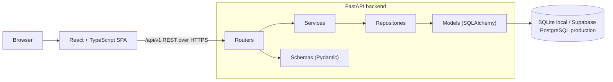
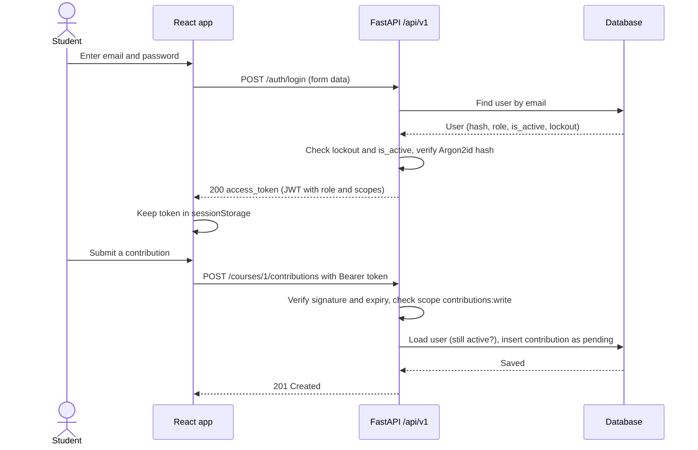
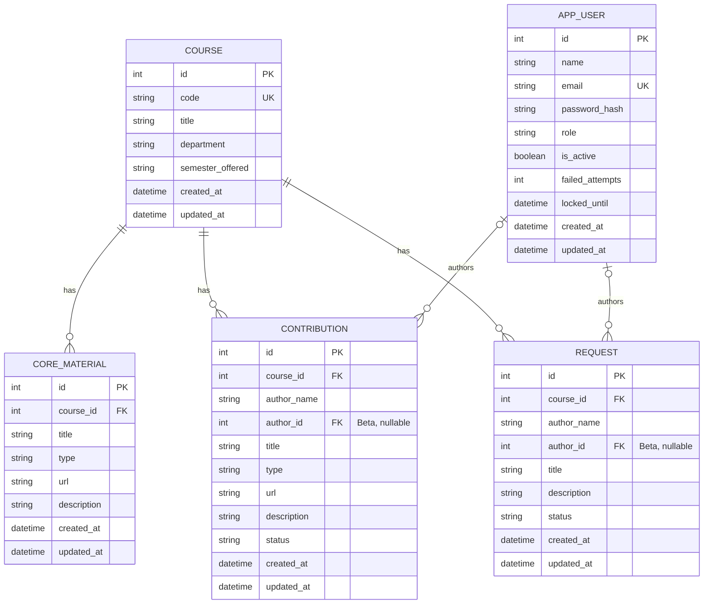
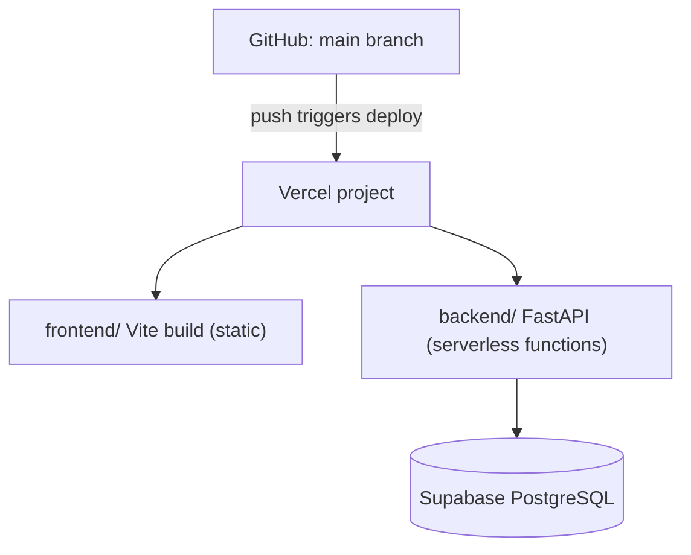

# TDD: Technical Design Document

## PassDown

| | |
|---|---|
| **Project** | PassDown, a course-material sharing platform |
| **Course** | CSE 309 Web Applications & Internet, Independent University, Bangladesh (IUB) |
| **Author** | [Your Full Name] |
| **Version** | 1.0 (Draft) |
| **Date** | October 2026 |
| **Related documents** | [PRD: Product Requirements Document](./01-prd.md) · [SRS: Software Requirements Specification](./02-srs.md) |

> Every design element is tagged **MVP** (mid-term demo, local, no login) or **Beta** (final demo, auth, RBAC, deployment). Requirement IDs (FR, NFR) refer to the [SRS](./02-srs.md).

---

## 1. Tech stack

| Layer | Technology | Release |
|---|---|---|
| Frontend | React, TypeScript (strict), Vite, React Router, Axios | MVP |
| Backend | Python 3.10+, FastAPI, Pydantic v2 | MVP |
| ORM | SQLAlchemy 2.0 | MVP |
| Database (local) | SQLite | MVP |
| Database (production) | PostgreSQL on Supabase, driver `psycopg` 3 | Beta |
| Migrations | Alembic | Beta |
| Authentication | JWT (PyJWT, HS256), OAuth2 password flow, FastAPI security scopes | Beta |
| Password hashing | Argon2id (`argon2-cffi`) | Beta |
| Hosting | Vercel (one project: frontend and backend) | Beta |

The repository starts from the course template `fastapi-vite-react-vercel-template`: `backend/` (FastAPI, routes under `/api`), `frontend/` (Vite + React + TypeScript), and `vercel.json`, which sends `/api/*` to the backend and everything else to the frontend.

## 2. Architecture

### 2.1 Overview



| Layer | Responsibility |
|---|---|
| **Routers** (`api/v1`) | HTTP only: parse the request, declare required scopes, call a service, shape the response. No business rules. |
| **Services** | Business rules: status transitions, ownership checks, lockout, cascading decisions. |
| **Repositories** | All database queries. No business rules. |
| **Models** | SQLAlchemy table definitions. |
| **Schemas** | Pydantic request and response models, separate from the models (so the password hash can never leak into a response). |

### 2.2 Login and protected request (Beta)



## 3. Project structure

```
passdown/
├── backend/                     FastAPI app, all routes under /api
│   ├── main.py                  App entry point (as in the template): CORS, routers, docs at /api/docs
│   ├── requirements.txt
│   ├── core/
│   │   ├── config.py            Settings from environment variables
│   │   ├── database.py          Engine, session, Base
│   │   └── security.py          Password hashing, JWT create/decode, scope definitions   (Beta)
│   ├── api/v1/
│   │   ├── courses.py
│   │   ├── core_materials.py
│   │   ├── contributions.py
│   │   ├── requests.py
│   │   ├── auth.py              register, login                                          (Beta)
│   │   ├── me.py                profile and dashboard data                               (Beta)
│   │   └── admin.py             stats, users                                             (Beta)
│   ├── dependencies/
│   │   └── auth.py              get_current_user with SecurityScopes                     (Beta)
│   ├── services/                one service per resource (course, material, contribution, request, auth, user, stats)
│   ├── repositories/            one repository per resource
│   ├── models/                  course, core_material, contribution, request, app_user (Beta)
│   ├── schemas/                 Pydantic models per resource
│   ├── scripts/
│   │   └── seed_admin.py        Create the first admin from env variables                (Beta)
│   └── alembic/                 Migrations                                               (Beta)
├── frontend/
│   └── src/
│       ├── api/                 Axios client and one module per resource
│       ├── auth/                AuthContext, ProtectedRoute, RoleRoute                   (Beta)
│       ├── components/          Shared UI (forms, tables, tabs, badges, layout)
│       ├── pages/               See section 12
│       ├── types/               TypeScript types mirroring the API schemas
│       └── App.tsx
├── docs/                        01-prd.md, 02-srs.md, 03-tdd.md
├── vercel.json                  /api/* to backend, everything else to frontend
├── .env.example
└── README.md
```

## 4. Data model

### 4.1 Entity relationship diagram



### 4.2 Tables

| Table | Release | Notes |
|---|---|---|
| `course` | MVP | `code` unique, stored in uppercase. |
| `core_material` | MVP | `course_id` foreign key with `ON DELETE CASCADE`. `type` is one of `slides`, `notes`, `past_paper`, `book`, `other`. |
| `contribution` | MVP | `status` is `pending` (default), `approved` or `rejected`. `author_name` is a plain display name in MVP. |
| `request` | MVP | `status` is `open` (default) or `fulfilled`. |
| `app_user` | Beta | Named `app_user` because `user` is a reserved word in PostgreSQL. `role` is `student` (default) or `admin`. `failed_attempts` and `locked_until` implement the login lockout (FR-31). |
| `contribution.author_id`, `request.author_id` | Beta | Nullable foreign key to `app_user` with `ON DELETE SET NULL`, added by a migration. In Beta the server fills `author_name` from the logged-in user. |

Indexes: unique on `course.code` and `app_user.email`; indexes on `course_id` of every child table and on `contribution.status`.

## 5. REST API

Base path `/api/v1`, JSON bodies, interactive docs at `/api/docs`. Until the first backend code is merged, the template still serves its docs at `/docs`.

**List responses** are wrapped: `{ "items": [...], "total": 42, "limit": 20, "offset": 0 }`. List endpoints accept `limit` and `offset` (NFR-02).

**Access columns:** in the MVP all endpoints are open. In Beta the access and scope shown apply.

### 5.1 Courses

| Method | Path | MVP | Beta access | Scope | Req |
|---|---|---|---|---|---|
| GET | `/courses?q=` | open | public | none | FR-01, FR-02 |
| GET | `/courses/{course_id}` | open | public | none | FR-03 |
| POST | `/courses` | open | admin | `courses:write` | FR-04 |
| PUT | `/courses/{course_id}` | open | admin | `courses:write` | FR-05 |
| DELETE | `/courses/{course_id}` | open | admin | `courses:write` | FR-06 |

### 5.2 Core materials

| Method | Path | MVP | Beta access | Scope | Req |
|---|---|---|---|---|---|
| GET | `/courses/{course_id}/core-materials?type=` | open | public | none | FR-07 |
| POST | `/courses/{course_id}/core-materials` | open | admin | `materials:write` | FR-08 |
| PUT | `/core-materials/{material_id}` | open | admin | `materials:write` | FR-09 |
| DELETE | `/core-materials/{material_id}` | open | admin | `materials:write` | FR-10 |

### 5.3 Contributions

| Method | Path | MVP | Beta access | Scope | Req |
|---|---|---|---|---|---|
| GET | `/courses/{course_id}/contributions?type=` | open (approved only) | public (approved only) | none | FR-11 |
| POST | `/courses/{course_id}/contributions` | open | student, admin | `contributions:write` | FR-12, FR-32 |
| PUT | `/contributions/{contribution_id}` | open (pending only) | owner (pending only) | `contributions:write` | FR-13, FR-35 |
| DELETE | `/contributions/{contribution_id}` | open | owner or admin | `contributions:write` | FR-14, FR-35 |
| GET | `/contributions?status=&course_id=` | open | admin | `contributions:moderate` | FR-16, FR-34 |
| PATCH | `/contributions/{contribution_id}/status` | open | admin | `contributions:moderate` | FR-15, FR-34 |

Status body: `{ "status": "approved" }` or `{ "status": "rejected" }`.

### 5.4 Requests

| Method | Path | MVP | Beta access | Scope | Req |
|---|---|---|---|---|---|
| GET | `/courses/{course_id}/requests?status=` | open | public | none | FR-17 |
| POST | `/courses/{course_id}/requests` | open | student, admin | `requests:write` | FR-18, FR-32 |
| PATCH | `/requests/{request_id}/fulfill` | open | owner or admin | `requests:write` | FR-19, FR-35 |
| DELETE | `/requests/{request_id}` | open | owner or admin | `requests:write` | FR-20, FR-35 |

### 5.5 Authentication and profile (Beta)

| Method | Path | Access | Scope | Req |
|---|---|---|---|---|
| POST | `/auth/register` | public | none | FR-28 |
| POST | `/auth/login` | public | none | FR-29, FR-31 |
| GET | `/me` | logged in | `profile:read` | FR-30 |
| PATCH | `/me` | logged in | `profile:write` | FR-37 |
| POST | `/me/password` | logged in | `profile:write` | FR-37 |
| GET | `/me/summary` | logged in | `profile:read` | FR-36 |
| GET | `/me/contributions` | logged in | `profile:read` | FR-36 |
| GET | `/me/requests` | logged in | `profile:read` | FR-36 |

`POST /auth/login` uses the standard OAuth2 password form (`username` is the email) and returns `{ "access_token": "...", "token_type": "bearer" }`.

### 5.6 Admin (Beta)

| Method | Path | Access | Scope | Req |
|---|---|---|---|---|
| GET | `/admin/stats` | admin | `stats:read` | FR-38 |
| GET | `/admin/users` | admin | `users:manage` | FR-39 |
| PATCH | `/admin/users/{user_id}/active` | admin | `users:manage` | FR-39 |

Body for the last one: `{ "is_active": false }`.

## 6. Authentication and authorization design (Beta)

### 6.1 Tokens
- On login the server issues one **access token**: JWT, HS256, expiry 60 minutes (NFR-13).
- Claims: `sub` (user id), `role`, `scope` (space-separated scopes), `iat`, `exp`.
- There are no refresh tokens (out of scope). When the token expires the user logs in again.

### 6.2 Scopes by role

| Scope | `student` | `admin` |
|---|:---:|:---:|
| `profile:read`, `profile:write` | ✅ | ✅ |
| `contributions:write`, `requests:write` | ✅ | ✅ |
| `courses:write`, `materials:write` | ❌ | ✅ |
| `contributions:moderate` | ❌ | ✅ |
| `stats:read`, `users:manage` | ❌ | ✅ |

The role-to-scope mapping lives in one place (`core/security.py`).

### 6.3 Enforcing scopes
FastAPI's `OAuth2PasswordBearer` with `scopes=` and `SecurityScopes` is used:

```python
oauth2_scheme = OAuth2PasswordBearer(
    tokenUrl="/api/v1/auth/login",
    scopes={"courses:write": "Manage courses", "contributions:moderate": "Review contributions"},
)

def get_current_user(security_scopes: SecurityScopes, token: str = Depends(oauth2_scheme), ...):
    # 1. decode and verify JWT        -> invalid or expired: 401
    # 2. load user from the database  -> missing or inactive: 401
    # 3. compare token scopes with security_scopes.scopes -> missing: 403

@router.post("/courses", status_code=201)
def create_course(data: CourseCreate, user: User = Security(get_current_user, scopes=["courses:write"])):
    ...
```

The token is verified, then the user is loaded from the database on each request, so a deactivated account stops working immediately (FR-40).

### 6.4 Ownership rules
Scopes say what kind of action a user may do; they cannot say whose item it is. Ownership is checked in the **service layer**: `item.author_id == current_user.id`, with admins allowed to delete any contribution and delete or fulfil any request (FR-35). A failed check returns `403`.

### 6.5 Registration, lockout and deactivation
- Registration always creates `role = student`; the request schema has no `role` field (NFR-18).
- Each failed login increments `failed_attempts`. At 5, `locked_until` is set 15 minutes ahead and login returns `429`. A successful login resets the counter. The state is stored in the database because serverless functions keep nothing in memory.
- An inactive user cannot log in (`403`), and their token is rejected on the next request (`401`).
- The first admin is created by `scripts/seed_admin.py` using `ADMIN_EMAIL` and `ADMIN_PASSWORD`. It is run once from a developer machine against the target database and is safe to run twice.

### 6.6 Profile and admin statistics
- `GET /me/summary` returns `{ "contributions": { "pending": 0, "approved": 0, "rejected": 0 }, "requests": { "open": 0, "fulfilled": 0 } }` for the current user only.
- `GET /admin/stats` returns `{ "users": 0, "courses": 0, "core_materials": 0, "contributions": { ...per status }, "requests": { ...per status } }`, computed with grouped `COUNT` queries.

## 7. Security design

| Threat | Measure | Release |
|---|---|---|
| SQL injection | ORM with bound parameters only (NFR-03) | MVP |
| Malicious links (`javascript:`) | Schema accepts only `http` and `https` URLs (NFR-04); links are rendered with `target="_blank"` and `rel="noopener noreferrer"` | MVP |
| Cross-site scripting | React escapes output; no `dangerouslySetInnerHTML`; restrictive Content-Security-Policy header | Beta |
| Password theft | Argon2id hashes; hashes never in responses or logs (NFR-12) | Beta |
| Credential guessing | Generic login error and per-account lockout (FR-31, NFR-15) | Beta |
| Privilege escalation | Role never accepted from the client; scopes from server-side mapping (NFR-18) | Beta |
| Broken object-level access | Ownership checks in services (FR-35) | Beta |
| Token theft | Short expiry, HTTPS only. The token is kept in `sessionStorage` (cleared when the tab closes); this is a known trade-off against `httpOnly` cookies, reduced by the XSS measures above | Beta |
| Cross-origin abuse | CORS allow-list: `http://localhost:5173` in development, same origin in production | Beta |
| Missing headers | `X-Content-Type-Options: nosniff`, `X-Frame-Options: DENY`, `Referrer-Policy: no-referrer`, set in the API middleware and in `vercel.json` for the frontend | Beta |
| Secret leakage | Secrets only in environment variables; `.env` ignored by Git; `.env.example` committed | Beta |

## 8. Configuration

| Variable | Used by | Example | Release |
|---|---|---|---|
| `DATABASE_URL` | Backend | `sqlite:///./passdown.db` locally; Supabase pooled URL in production | MVP, Beta |
| `JWT_SECRET` | Backend | At least 32 random characters | Beta |
| `JWT_EXPIRE_MINUTES` | Backend | `60` | Beta |
| `CORS_ORIGINS` | Backend | `http://localhost:5173` | Beta |
| `ADMIN_EMAIL`, `ADMIN_PASSWORD` | Seed script only (local) | Never set on Vercel | Beta |

Generate a secret with:
```bash
python -c "import secrets; print(secrets.token_urlsafe(48))"
```

## 9. Database setup

### 9.1 Local (MVP)
SQLite file `passdown.db`, created automatically on first run. It is listed in `.gitignore`. The engine uses `connect_args={"check_same_thread": False}`.

### 9.2 Production (Beta)
- Create a free Supabase project and copy the **connection pooler** string (transaction mode). Vercel functions are short-lived, so the pooler avoids exhausting database connections.
- Use the `postgresql+psycopg://` scheme. Because the pooler is in transaction mode, create the engine with `NullPool` and disable prepared statements (`connect_args={"prepare_threshold": None}`).
- Vercel's filesystem is read-only, so SQLite cannot be used in production.

## 10. Migrations (Beta)

- MVP creates tables automatically for the local SQLite database.
- From Beta, Alembic owns the schema. The first migration creates the MVP tables; the second adds `app_user` and the nullable `author_id` columns.
- Migrations are applied from a developer machine: `alembic upgrade head` with `DATABASE_URL` pointing at Supabase. They are not run during the Vercel build.

## 11. Deployment (Beta)



1. The repository is connected to Vercel with **Root Directory** `./`; every push to `main` redeploys, and pull requests get preview deployments.
2. `vercel.json` routes `/api/*` to the backend and everything else to the frontend, so production is same-origin.
3. Environment variables are set in the Vercel dashboard.
4. After the first deploy: apply migrations, then run the seed script to create the admin.
5. Known limitation: free-tier serverless functions may add a short delay on the first request after inactivity (NFR-17).

## 12. Frontend design

### 12.1 Routes

| Route | Page | MVP | Beta access |
|---|---|---|---|
| `/` | Course list with search | open | public |
| `/courses/:id` | Course page with tabs: Core Materials, Contributions, Requests, plus submit forms | open | public to read; forms need login |
| `/admin/courses` | Manage courses | open | admin |
| `/admin/materials` | Manage core materials | open | admin |
| `/admin/moderation` | Review pending contributions | open | admin |
| `/login`, `/register` | Authentication | n/a | public |
| `/dashboard` | Profile dashboard | n/a | student, admin |
| `/admin` | Admin dashboard: queue, statistics, users | n/a | admin |

### 12.2 Behaviour
- **API client:** one Axios instance with base URL `/api/v1`. In development Vite proxies `/api` to port 8000.
- **Auth state (Beta):** `AuthContext` holds the user and token. A request interceptor adds `Authorization: Bearer <token>`. A response interceptor handles `401` by clearing the session and redirecting to `/login` (FR-44).
- **Route guards (Beta):** `ProtectedRoute` requires login; `RoleRoute` also requires a role. Buttons and links for actions the user cannot perform are hidden (FR-43). The server remains the real authority.
- **Types:** TypeScript interfaces in `src/types` mirror the backend schemas, including the scope and role names.
- **UX:** loading and error states on every data view, validation messages on forms, and an external-link notice for material links (NFR-09).

## 13. Risks

| Risk | Impact | Mitigation |
|---|---|---|
| SQLite cannot persist on Vercel | Production data loss | Use Supabase PostgreSQL in production (section 9.2). |
| Serverless exhausts database connections | Random 500 errors | Pooled connection string, `NullPool`. |
| Cold starts slow the demo | Poor first impression | Open the app once before the demo; documented in NFR-17. |
| Secret committed by mistake | Account takeover | `.gitignore`, `.env.example`, rotate the secret if it leaks. |
| Frontend and backend role names drift apart | Broken guards | Single mapping in `core/security.py`; mirrored constants in `src/types`. |
| Beta scope too large for the time left | Unfinished demo | Must items first (F-08 to F-11, F-15), Should items last (F-12 to F-14). |
